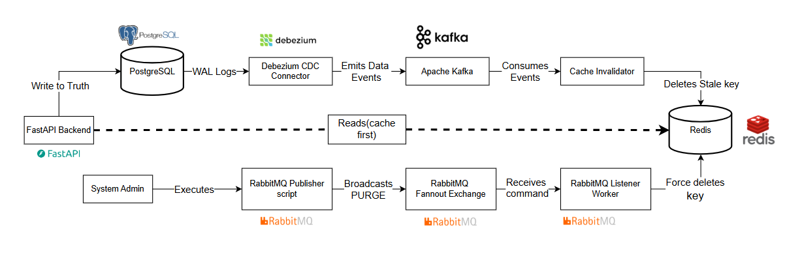

# Production CDC & Event-Driven Architecture Platform

An event-driven data platform showcasing real-time Change Data Capture (CDC), intelligent cache consistency, and distributed command orchestration using PostgreSQL, Debezium, Kafka, RabbitMQ, Redis, and FastAPI.

---

## 🛑 The Problem: Cache Staleness & Tight Coupling

In modern scalable applications, keeping a high-speed cache (like Redis) synchronized with a persistent source of truth (like PostgreSQL) is notoriously difficult. 
In traditional "Dual-Write" architectures, the API is responsible for updating both the Database and the Cache. This leads to:
* **Tight Coupling:** The API must manage cache logic, increasing complexity.
* **Race Conditions:** If the API crashes between the DB write and the Cache update, data becomes permanently desynchronized.
* **DBA Blind Spots:** Manual updates made directly to the Database (e.g., via psql) bypass the API, leaving the Cache stale indefinitely.

## ✅ The Solution: Hybrid Event-Driven Architecture

### 1. Kafka-Powered CDC (The "Past" - State)
Instead of the API managing the cache, we use **Change Data Capture**:
* **The Write:** The API writes *only* to PostgreSQL.
* **The Capture:** **Debezium** tails the PostgreSQL Write-Ahead Log (WAL), capturing every row-level change.
* **The Stream:** Changes are streamed into **Kafka** (KRaft mode).
* **The Invalidation:** A decoupled **Cache Invalidator Worker** consumes the Kafka topic and purges specific Redis keys.
* **Guarantee:** **Eventual Consistency.** If the worker is down, it resumes from the last offset upon restart, ensuring no update is missed.

### 2. RabbitMQ Signaling (The "Present" - Commands)
When a system-wide emergency occurs (e.g., corrupted config), row-by-row CDC is too slow. We use a **Fanout Exchange** for "Nuclear" commands:
* **The Trigger:** An admin executes a Python script sending an 11-byte `PURGE_CACHE` command.
* **The Broadcast:** RabbitMQ acts as a "Radio Tower," broadcasting the command to every active listener simultaneously via temporary anonymous queues.
* **The Execution:** Every listener worker immediately executes `flushdb()` on Redis.
* **Guarantee:** **Instantaneous Action.** Designed for high-priority, volatile commands that require immediate execution across a scaled fleet.


### Kafka vs. RabbitMQ: Separation of Concerns
This project intentionally uses both Kafka and RabbitMQ to demonstrate a critical architectural distinction:
* **Kafka (Data Synchronization)**: Used for *Events* ("What Happened in the past"). State replication and CDC.
* **RabbitMQ (System Signaling)**: Used for *Commands* ("What to Do right now"). Instantly broadcasting manual `PURGE_CACHE` commands to a fleet of listeners.

---

## 🏛 Architecture Overview



---

## 🚀 Key Modernization Features

This repository has been fully refactored to align with senior-level DevOps and Data Engineering standards:

1. **Microservice Isolation**: Complete segregation of duties. The FastApi backend, Kafka Cache Invalidator, and RabbitMQ Listener are packaged independently with their own lean dependency bounds (`requirements.txt` per service).
2. **Kafka KRaft Migration**: Apache Kafka has been modernized to run in **KRaft Mode (Kafka Raft)**. ZooKeeper dependency has been entirely removed, drastically reducing compute footprint and speeding up cluster boot times.
3. **Resiliency & Fault Tolerance**: Both python worker services feature recursive `pika` and `kafka-python` connection loops globally. If the infrastructure takes 15 seconds to spin up, the workers gracefully wait and reconnect instead of crash-looping.
4. **DevOps Hardening**:
   - Single monolithic Dockerfiles were shattered into optimized, multi-stage, purpose-built `.Dockerfile` images.
   - `docker-compose.yml` mapped with exact `depends_on: condition: service_healthy` directives, ensuring logical orchestration flow.
   - Hardcoded IPs and credentials extracted into a centralized `.env` configuration schema.

---

## 📂 Project Structure

```text
cdc-project/
├── .env.example                # Global configuration layout
├── docker-compose.yml          # Core orchestration
├── README.md
├── infrastructure/
│   ├── debezium/               # Debezium Connector mappings
│   └── docker/
│       ├── api.Dockerfile
│       ├── cache-invalidator.Dockerfile
│       └── rabbit-listener.Dockerfile
├── scripts/
│   └── rabbitmq_publisher.py   # Manual RabbitMQ broadcaster tool
└── services/
    ├── api/                    # FastAPI Backend Application
    │   ├── requirements.txt
    │   └── src/
    ├── cache-invalidator/      # Kafka CDC Event Consumer
    │   ├── requirements.txt
    │   └── src/
    └── rabbit-listener/        # RabbitMQ Command Consumer
        ├── requirements.txt
        └── src/
```

---

## 🛠 Getting Started

### 1. Configure the Environment
Clone the repository and inject the environment variables.
```bash
cp .env.example .env
```

### 2. Boot the Infrastructure
Start the entire data engineering pipeline via Docker Compose.
```bash
docker-compose up --build -d
```
*Note: The Python microservices will cleanly wait for PostgreSQL, Redis, Kafka, and RabbitMQ to pass their explicit container healthchecks before connecting.*

### 3. Verify the Endpoints
Hit the FastAPI service:
```bash
curl http://localhost:8000/users
```
You will see `CACHE MISS` in the `cdc_fastapi` logs followed by a `CACHE HIT` on subsequent requests.

### 4. Test the System Signaling (RabbitMQ)
Force clear the cache across the entire topology by broadcasting via the publisher script:
```bash
python scripts/rabbitmq_publisher.py
```
Watch the Rabbit Listener elegantly purge the cache:
```bash
docker logs cdc_rabbit_listener -f
```

### 5. Test the CDC Synchronization (Kafka)
Simulate a manual database intervention by entering the PostgreSQL container and mutating data manually:
```bash
docker exec -it cdc_postgres psql -U admin -d social_db
> INSERT INTO users (username, bio) VALUES ('kraft_user', 'I bypass the API!');
```
Watch the Cache Invalidator instantly pick up the WAL log mutation via Kafka and invalidate the Redis key:
```bash
docker logs cdc_cache_invalidator -f
```
